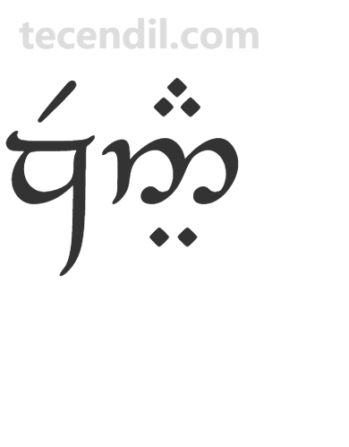

# 简介
Speak Elf Yourself是Helge Kåre Fauskanger自2024年起发布在YouTube上的昆雅语课程系列教学视频。课程全程使用昆雅语讲述，在举例说明时，作者常常会亲自上镜表演、引用其他IP或者结合时事热点，生动形象且幽默风趣。

# 资源
[课程视频](https://www.youtube.com/playlist?list=PLpRrGdALEBTVeGyy2AQop_piuG9hJ5P0d)

# 我的笔记

## 说明

## 1
出现在标题Speak Elf Yourself周围的安那塔体的滕格瓦字母分别为Quenya、Eldarin和Arcastaro Endo Lambë。

zJ5#Ì

